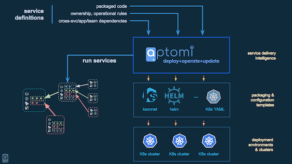
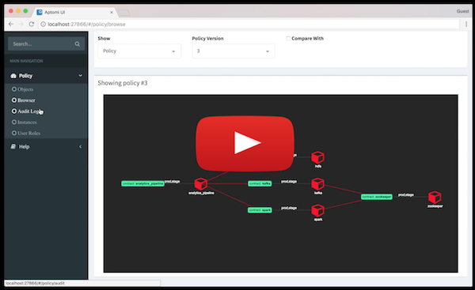
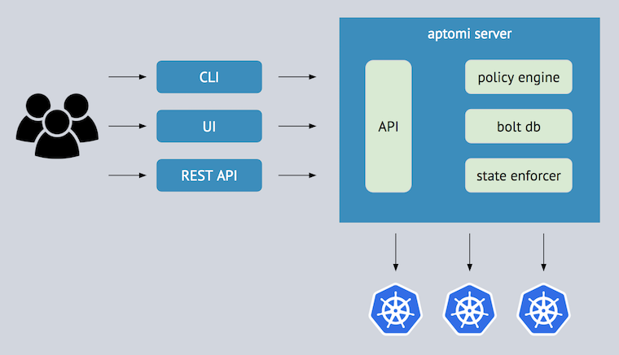
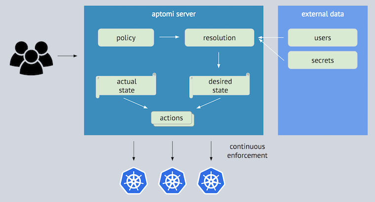
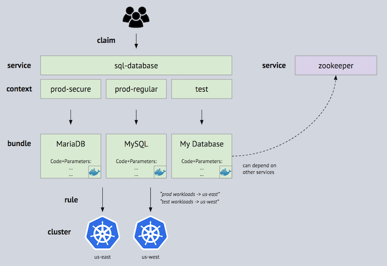

[](https://github.com/Aptomi/aptomi/releases/latest)
[](https://github.com/Aptomi/aptomi/LICENSE.md)
[](https://goreportcard.com/report/github.com/Aptomi/aptomi)
[](https://ci.aptomi.io/job/aptomi%20-%20tests/)
[](https://coveralls.io/github/Aptomi/aptomi)
[](https://godoc.org/github.com/Aptomi/aptomi)
[](https://github.com/Aptomi/aptomi/commits/master)
[](http://slack.aptomi.io)

[Aptomi](http://aptomi.io) simplifies roll-out, operation and control of container-based applications on k8s. It introduces a
**service-centric abstraction** that allows Dev and Ops to collaborate asynchronously. It enables teams to create and operate services,
share them across the organization, fully control their lifecycle while enforcing Ops/Governance policies. Changes and updates are executed
with a goal of minimizing disruptive impact on depending services.

It is particularly useful in environments with multiple teams, clouds and data centers, where intent-based management
plays an important role in running large application infrastructure. Aptomi’s current focus is **Kubernetes**, but it's
designed to work with any container runtime and container orchestration technologies.



## Demo

### Short demo (5 minutes, Asciinema)
[](https://asciinema.org/a/k8ZpQTazoSaDV24fiLbG7DfT9?speed=2)

### Detailed demo (13 minutes, Youtube)
[](http://www.youtube.com/watch?v=HL4RwoBnuTc)

## Table of contents
<!-- START doctoc generated TOC please keep comment here to allow auto update -->
<!-- DON'T EDIT THIS SECTION, INSTEAD RE-RUN doctoc TO UPDATE -->


- [Features & Benefits](#features--benefits)
- [Quickstart](#quickstart)
  - [Installation](#installation)
  - [Setting up k8s Clusters](#setting-up-k8s-clusters)
  - [Running Examples](#running-examples)
- [Architecture & How It Works](#architecture--how-it-works)
  - [Components](#components)
  - [State Enforcement](#state-enforcement)
  - [Language](#language)
- [Dev Guide](#dev-guide)
  - [Building From Source](#building-from-source)
  - [Tests & Code Validation](#tests--code-validation)
  - [Web UI](#web-ui)
  - [How to contribute](#how-to-contribute)
  - [How to release](#how-to-release)
  - [Roadmap](#roadmap)

<!-- END doctoc generated TOC please keep comment here to allow auto update -->

## Features & Benefits
- **Deploy and manage container-based applications with ease**
  - Dev and Ops think applications and services, not infrastructure primitives and thousands of containers
  - Built-in service discovery ensures all dependencies always are up to date
  - No need to change existing application templates (Helm, Ksonnet, k8s YAMLs, etc)
  - Run on k8s, OpenShift (support for AWS ECS, GKE, Docker Datacenter, Mesos is pluggable)
- **Lazy allocation of resources**
  - Containers are only running when the corresponding service has consumers
- **Continuous state enforcement**
  - Desired state of all services is rendered as a DAG system and continuously validated/enforced
  - Changes/rules can be enforced at any time (change service parameters, relocate the whole application w/ dependencies to another cluster, restrict access, etc)
  - Disruption impact of change on depending services is minimized
- **Flexible rule engine**. Examples:
  - *Production Instances* get deployed to *us-west*, *Staging Instances* get deployed to *us-west*
  - *Web* and *Mobile* teams always share the same *small* flavor of *Analytics* service in *Staging*, while 
    *Healthcare* team gets a dedicated *high-performance* instance of the same service
  - *Development* teams can never deploy to *Production*
  - *Personal* development instances of *MyApp* can only be running *from 7am to 11pm* and should be terminated overnight 
    for all developers
- **Insights & Contextual visibility**
  - UI to explore services instances, see why services were instantiated, visualize dependencies and impact of changes

## Quickstart

### Installation
There are several ways to install Aptomi. The simplest one is **Compact**, but you may pick one that suits your needs:

Installation Mode     | Aptomi | App Deployment | Description
----------------------|--------------------|----------------|-------------
[Compact](docs/install_compact.md) | Local machine | *Yes* | Aptomi will be installed on a local machine (binaries or in a single Docker container)
[Kubernetes](docs/install_kubernetes.md) | Container on k8s  | *Yes* | Aptomi will be deployed on k8s via Helm chart

You can also install it in a stripped-down mode, mostly to explore concepts and look at API/UI. It will use a fake executor and thus will **NOT** be able to perform any app deployments to k8s:

Installation Mode     | Aptomi / UI | App Deployment | Description
----------------------|--------------------|----------------|-------------
[Concepts](docs/install_concepts.md) | Local machine | *No* | Use this only if you want get familiar with Aptomi concepts, API and UI. k8s is not required

### Setting up k8s Clusters

You need to have access to 2 k8s clusters (or use two namespaces within the same cluster) in order to deploy services from the provided examples. This allows to
take full advantage of Aptomi policy engine and use rules to deploy applications to different clusters.

Kubernetes Cluster | When to use     | How to run
------------|-----------------|-----------
Your own    | If you already have k8s cluster set up | [Configure Aptomi to use an existing k8s cluster](docs/k8s_own.md)
Google Kubernetes Engine | Useful if you have a new Google account and free credits | [Configure Aptomi to use GKE](docs/k8s_gke.md)
k8s / Minikube | Single-node, local machine with 16GB+ RAM | [Configure Aptomi to use Minikube](docs/k8s_minikube.md)
k8s / Docker For Mac | Single-node, local machine with 16GB+ RAM | [Configure Aptomi to use Docker For Mac](docs/k8s_docker_for_mac.md)

Having a powerful k8s cluster with good internet connection will definitely provide *better experience* compared to a single-node k8s local cluster. GKE would be one of the best options.

### Running Examples

Once Aptomi server is up and k8s clusters are ready, you can get started by running the following examples:

Example    | Description
-----------|------------
[twitter-analytics](examples/twitter-analytics) | Twitter Analytics Application, multiple services, 2 k8s clusters

## Architecture & How It Works

### Components
 

### State Enforcement


### Language


See [language documentation](docs/language.md)

## Dev Guide

### Building From Source
In order to build Aptomi from source you will need Go (the latest 1.9.x) and a couple of external dependencies:
* glide - all Go dependencies for Aptomi are managed via [Glide](https://glide.sh/)
* docker - to run Aptomi in container, as well as to run sample LDAP server with user data
* kubernetes-cli and kubernetes-helm for using Kubernetes with Helm
* npm - to build UI, as well as automatically generate table of contents in README.md 
* telnet, jq - for the script which runs smoke tests

If you are on macOS, install [Homebrew](https://brew.sh/) and [Docker For Mac](https://docs.docker.com/docker-for-mac/install/), then run: 
```
brew install go glide docker kubernetes-cli kubernetes-helm npm telnet jq
```

Check out Aptomi source code from the repo:
```
mkdir -p $GOPATH/src/github.com/Aptomi
cd $GOPATH/src/github.com/Aptomi
git clone https://github.com/Aptomi/aptomi.git
```

In order to build Aptomi, you must first tell Glide to fetch all of its dependencies. It will read the list of
dependencies defined in `glide.lock` and fetch them into a local "vendor" folder. After that, you must run Go to
build and install the binaries. There are convenient Makefile targets for both, run them:
```
make vendor 
make install
```

### Tests & Code Validation

Command    | Action          | LDAP Required
-----------|-----------------|--------------
```make test```    | Unit tests | No
```make alltest``` | Integration + Unit tests | Yes
```make smoke```   | Smoke tests + Integration + Unit tests | Yes
```make profile-engine```   | Profile engine for CPU usage | No
```make coverage```   | Calculate code coverage by unit tests | No
```make coverage-full```   | Calculate code coverage by unit & integration tests | Yes

Command     | Action          | Description
------------|-----------------|--------------
```make fmt```  | Re-format code | Re-formats all code according to Go standards
```make lint``` | Examine code | Run linters to examine Go source code and reports suspicious constructs

### Web UI
Source code is available in [webui](webui)

Make sure you have latest `node` and `npm`. We have tested with node v8.9.1 and npm 5.5.1 and it's
known to work with these.

Command     | Action
------------|----------
```npm install```  | Install dependencies
```npm run dev``` | Serve with hot reload at localhost:8080
```npm run build``` | Build for production with minification
```npm run build --report``` | Build for production and view the bundle analyzer report
```npm run unit``` | Run unit tests: *coming soon*
```npm run e2e``` | Run e2e tests: *coming soon*
```npm run test``` | Run all tests: *coming soon*

### How to contribute
Report a bug. Send us a pull request.

List of areas where we could use help:
- Feedback from Dev & Ops teams on service & rule definitions
- Adding support for additional cloud providers (AWS ECS, GKE, Docker Datacenter, Mesos)
- Also, see [Feature Backlog](https://github.com/Aptomi/aptomi/milestone/11)

### How to release
Use `git tag` and `make release` for creating new release.

1. Create annotated git tag and push it to github repo. Use commit message like `Aptomi v0.1.2`.

```
git tag -a v0.1.2
git push origin v0.1.2
```

1. Create GitHub API token with the `repo` scope selected to upload artifacts to GitHub release page. You can create
one [here](https://github.com/settings/tokens/new). This token should be added to the environment variables as `GITHUB_TOKEN`.

1. Run `make release`. It'll create everything needed and upload all artifacts to github.

1. Go to https://github.com/Aptomi/aptomi/releases/tag/v0.1.2 and fix changelog / description if needed.

### Roadmap
[Feature Backlog](https://github.com/Aptomi/aptomi/milestone/11), as well as weekly project milestones, are good places to look at the roadmap items.

If you have any questions, please contact us on [](http://slack.aptomi.io).
