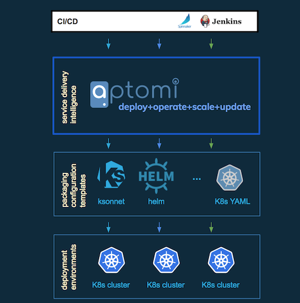

[](https://goreportcard.com/report/github.com/Aptomi/aptomi)
[](https://ci.aptomi.io/job/aptomi%20-%20tests/)
[](https://coveralls.io/github/Aptomi/aptomi)
[](https://godoc.org/github.com/Aptomi/aptomi)
[]()
[](https://slack.aptomi.io)

[Aptomi](http://aptomi.io) simplifies roll-out, operation and control of complex container-based applications. Instead of dealing with
thousands of individual containers, Dev and Ops can now talk services. Service-based approach enables Dev to move
faster, while providing control and insights/contextual visibility to Ops.

It is particularly useful in environments with multiple teams, clouds and data centers, where intent-based management
plays an important role in running large application infrastructure. Aptomi’s current focus is Kubernetes, but it's
designed to work with any container runtime and container orchestration technologies.

## Table of contents
<!-- START doctoc generated TOC please keep comment here to allow auto update -->
<!-- DON'T EDIT THIS SECTION, INSTEAD RE-RUN doctoc TO UPDATE -->


- [Features & Benefits](#features--benefits)
- [Where Aptomi is located in the stack](#where-aptomi-is-located-in-the-stack)
- [User Guide](#user-guide)
  - [Installation](#installation)
  - [Configuring LDAP](#configuring-ldap)
  - [Getting Started & Examples](#getting-started--examples)
  - [Architecture & How It Works](#architecture--how-it-works)
    - [Components](#components)
    - [State Enforcement](#state-enforcement)
    - [Language](#language)
  - [Aptomi language](#aptomi-language)
- [Dev Guide](#dev-guide)
  - [Building From Source](#building-from-source)
  - [Tests & Code Validation](#tests--code-validation)
  - [Web UI](#web-ui)
  - [How to contribute](#how-to-contribute)
  - [Roadmap](#roadmap)

<!-- END doctoc generated TOC please keep comment here to allow auto update -->

## Features & Benefits
- **Easy way to deploy and manage complex applications**
  - See [example](examples/03-twitter-analytics/diagram.png) of a multi-service application based entirely on containers
- **Run on top of any container platform**
  - k8s, OpenShift (with support coming for AWS ECS, GKE, Docker Datacenter, Mesos)
- **Friendly for Dev and Ops**
  - Keep using your existing application templates (Helm, k8s YAMLs, ksonnet, Ansible, etc)
  - Speak services, not containers. Collaborate between orgs and rely on services published by other teams
  - Easy changes to the running code -- seconds to propagate updated parameters, relocate the whole stack to another cluster, restrict access, etc
- **Continuous state enforcement**
  - Desired state of all services is rendered as a system and continuously validated/enforced 
  - Built-in service discovery ensures all dependencies always are up to date    
- **Lazy allocation of resources**
  - Containers are running only when needed (i.e. when someone declared an intent to consume the corresponding service)
- **Flexible rule engine. *See examples of user-defined rules:***
  - *Production Instances* get deployed to *us-west*, *Staging Instances* get deployed to *us-west*
  - *Web* and *Mobile* teams always share the same *small* flavor of *Analytics* service in *Staging*, while 
    *Healthcare* team gets a dedicated *high-performance* instance of the same service
  - *Development* teams can never deploy to *Production*
  - *Personal* development instances of *MyApp* can only be running *from 7am to 11pm* and should be terminated overnight 
    for all developers
- **Insights & Contextual visibility**
  - UI to understand what services are running, why they were instantiated, visualize dependencies and impact of changes. No
    need to deal with thousands of individual containers
     
        
## Where Aptomi is located in the stack
Aptomi sits in between CI/CD and container orchestration. Being in deployment path for applications, it can apply
higher-level policy rules (see examples above) and configure the underlying infrastructure components accordingly. 

 

## User Guide

### Installation
TODO: "go get", script, docker container? it needs to have clients, etc

### Configuring LDAP
Aptomi needs to be configured with user data source in order to enable UI login and retrieve labels/properties for the users. It's recommended to
start with LDAP, which is also required by Aptomi examples and smoke tests.
1. LDAP Server with sample users is provided in a docker container. To download and start it, run:
    ```
    ./tools/demo-ldap.sh
    ```
2. It's also recommended to download and install [Apache Directory Studio](http://directory.apache.org/studio/) for browsing LDAP. Once installed, follow these [step-by-step instructions](http://directory.apache.org/apacheds/basic-ug/1.4.2-changing-admin-password.html) to connect

### Getting Started & Examples
Obviously, you will need k8s cluster to deploy the examples. Two k8s clusters would be even better, to take full advantage of Aptomi rule engine.
If you don't have k8s clusters set up, follow [these instructions](examples/README.md) and run the [provided script](tools/demo-gke.sh) to create them in Google Cloud.

Once Aptomi is installed and k8s clusters are set up, you can get started by running the following examples:

Example    | Description  | Diagram
-----------|--------------|--------------
[examples/01](examples/01) | Description of Example 1 | [Diagram for example #1](examples/01/diagram.png)  
[examples/02](examples/02) | Description of Example 2 | [Diagram for example #2](examples/02/diagram.png)
[examples/03-twitter-analytics](examples/03-twitter-analytics) | Twitter Analytics Application, 2 k8s clusters | [Diagram for example #3](examples/03-twitter-analytics/diagram.png)

### Architecture & How It Works

#### Components
 

#### State Enforcement


#### Language


### Aptomi language
TODO: policy documentation 

## Dev Guide

### Building From Source
Building Aptomi from source and running integration tests is a very straightforward process. All you need is Go (ideally 1.9.1) and a couple of external packages:
* docker - to run Aptomi in container, as well as to run sample LDAP server with user data
* npm - to build UI, as well as automatically generate table of contents in README.md 
* telnet - for the script which runs smoke tests

Check out Aptomi source code from the repo:
```
mkdir $GOPATH/src/github.com/Aptomi
cd $GOPATH/src/github.com/Aptomi
git clone git@github.com:Aptomi/aptomi.git
```

If you are on macOS, install brew, install [Docker For Mac](https://docs.docker.com/docker-for-mac/install/) and run: 
```
brew install telnet docker npm
```

Install Helm, Kubectl clients:
```
./tools/install-clients.sh
```

All Go dependencies are managed using [Glide](https://glide.sh/). The following command will fetch all dependencies defined in `glide.lock` and put them into "vendor" folder:
```
make vendor 
```

To build the binary:
```
make 
```

### Tests & Code Validation

Command    | Action          | LDAP Required
-----------|-----------------|--------------
```make test```    | Unit tests | No
```make alltest``` | Integration + Unit tests | Yes
```make smoke```   | Smoke tests + Integration + Unit tests | Yes
```make profile-engine```   | Profile engine for CPU usage | No
```make coverage```   | Calculate code coverage by unit tests | No
```make coverage-full```   | Calculate code coverage by unit & integration tests | Yes

Command     | Action          | Description
------------|-----------------|--------------
```make fmt```  | Re-format code | Re-formats all code according to Go standards
```make lint``` | Examine code | Run linters to examine Go source code and reports suspicious constructs

### Web UI
Source code is available in [webui](webui)

Command     | Action
------------|----------
```npm install```  | Install dependencies
```npm run dev``` | Serve with hot reload at localhost:8080
```npm run build``` | Build for production with minification
```npm run build --report``` | Build for production and view the bundle analyzer report
```npm run unit``` | Run unit tests: *coming soon*
```npm run e2e``` | Run e2e tests: *coming soon*
```npm run test``` | Run all tests: *coming soon*

### How to contribute
Report a bug. Send us a pull request.

List of areas where we could use help:
- Feedback from Dev & Ops teams on service & rule definitions
- Adding support for additional cloud providers (AWS ECS, GKE, Docker Datacenter, Mesos)
- Also, see [Feature Backlog](https://github.com/Aptomi/aptomi/milestone/11)

### Roadmap
We will soon publish the list of items for Q4 2017 and Q1 2018. In the meantime,
[Feature Backlog](https://github.com/Aptomi/aptomi/milestone/11) is a good place to look at the roadmap items
which are being considered.

If you have any questions, please contact us on Slack.
