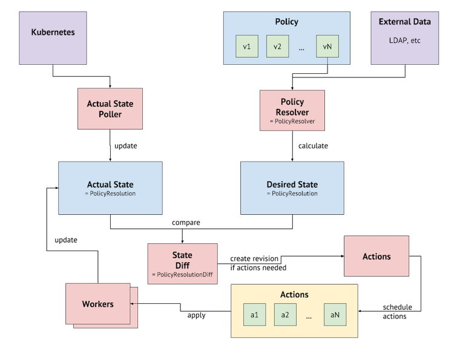

# Aptomi Architecture

## Components
Aptomi consists of two main binaries:
* Aptomi Server - `aptomi` is a server, which serves the API & UI as well as handling the deployment and continuous state enforcement of applications/components running on Kubernetes.
* Aptomi Client - `aptomictl` is a client, which talks to the Aptomi Server via the API. It allows end-users to interact with Aptomi. 

 

The Aptomi server has the following main internal components:
* **UI and API** - served over HTTP.
* **Policy Engine** - engine to process the uploaded "policy" (app definitions, cluster definitions, rules) and translate it into a `Desired State`.
* **State Enforcer** - applies `Desired State`, creating/updating/deleting containers in Kubernetes and applying configs/rules.
* **Database** - uses [Bolt](https://github.com/boltdb/bolt) as a database to persist its data.

## State Enforcement
Aptomi has a notion of `Desired State` and `Actual State`:
* `Desired State` defines which components should be running, where, how they should be configured, and how the insfrastructure components around them should be set up.
* `Actual State` is a result of applying changes. It may not be equal to the desired state, for example, when Aptomi tries to create/update/delete a container in Kubernetes, but is unable to.

Aptomi is continuously validating/enforcing the state, always trying to reconcile `Desired State` and `Actual State`. 

