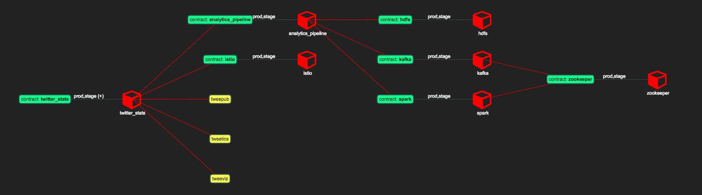
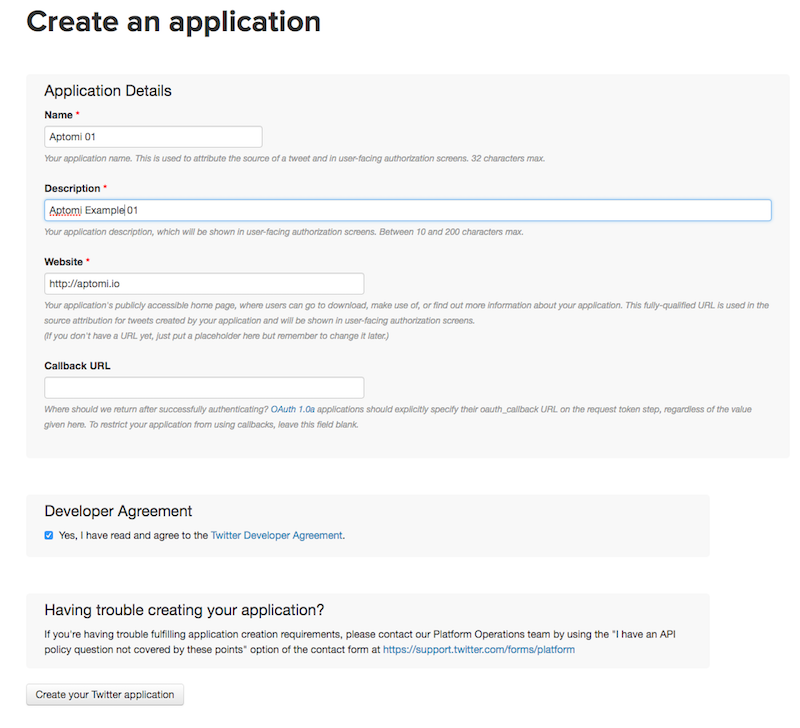

# Demo scenario

In this example there are 2 main services:
- analytics_pipeline- it consists of kafka, spark, hdfs, zookeeper and is offered in two different contexts
  - *stage*: in sharing all consumers of analytics_pipeline get to share the same instance
  - *production*: a single production instance with more memory, better replicas count, etc 
- twitter_stats - it depends on analytics_pipeline and consists of 3 components (publisher, stats, ui).
  It gets data from Twitter in real time, calculates top hashtags using an external analytics_pipeline service and displays
  results on a web page.  



These services have different owners, who can fully control how their services get offered and shared:
- Frank defined analytics_pipeline
- John defined twitter_stats
- Alice, Bob, Carol are services consumers and/or code contributors
- Sam is a domain admin for Aptomi

This example illustrates a few important things that Aptomi does:
1. Service definitions & instantiation
    - Service owners publish their services and fully define how they get offered & shares to others
    - Implementation details are abstracted away from consumers, so they can consume other services without knowing the inner-workings
1. Service update
    - Change parameter/label with a single command and re-apply only the required delta 
1. Service reuse
    - Alice and Bob share the same instance of analytics_pipeline in staging
1. Policy & rules
    - Different people have different access rights within Aptomi object model
    - Aptomi can allocate instances with different parameters in different clusters (e.g. based on consumer identity)

# Instructions

1. First of all, bootstrap Aptomi on behalf on Sam (domain admin) to import k8s clusters and rules. ACL rules are defined in such
a way that Sam is a domain admin, John/Frank are namespace admins, and Alice/Bob/Carol are service consumers
    ```
    aptomictl policy apply --username Sam -f examples/03-twitter-analytics/policy/Sam
    ```
1. Import analytics_pipeline service definition on behalf of Frank
    ```
    aptomictl policy apply --username Frank -f examples/03-twitter-analytics/policy/Frank
    ```
1. Import twitter_stats service definition on behalf of John
    ```
    aptomictl policy apply --username John -f examples/03-twitter-analytics/policy/John
    ```
1. At this point all service definition have been published to Aptomi, but nothing has been instantiated yet. You can see
that in Aptomi UI.
    [TODO]

1. Now, we need to provide user secrets, so twitter_stats component can pull data over Twitter Streaming API. Create 3
applications in [Twitter Application Management Console](https://apps.twitter.com)
    
    
    Generate keys and access tokens for them:
    
    
    Once done, copy secrets.yaml and enter the created keys/tokens into it:
   ```
   cp examples/03-twitter-analytics/_external/secrets/secrets.{yaml.template,yaml}
   vi examples/03-twitter-analytics/_external/secrets/secrets.yaml
   ```

1. Now let's have consumers declare 'dependencies' on the services defined by John and Frank. John requests an instance
    ```
    aptomictl policy apply --username John -f examples/03-twitter-analytics/policy/john-prod-ts.yaml
    ```
    Aptomi allocates a production instance in cluster [TODO]:
    [TODO] picture
    [TODO] delta

1. Alice and Bob request instances
    ```
    aptomictl policy apply --username Alice -f examples/03-twitter-analytics/policy/alice-stage-ts.yaml
    aptomictl policy apply --username Bob -f examples/03-twitter-analytics/policy/bob-stage-ts.yaml
    ```
    Alice tests a change. Bob looks at Mexico.
    Aptomi allocates staging instances in cluster [TODO]:
    [TODO] picture
    [TODO] delta

1. If everything got deployed successfully, then you should be able to see 
    [TODO] delta

1. Demonstrating update on a running instance of twitter stats in production. Alice removes her dependency and asks John to update production instance
    Removing Alice's dependency:
    ```
    aptomictl policy delete --username Alice -f examples/03-twitter-analytics/policy/alice-stage-ts.yaml
    ```
    Changing John's dependency:
    ```
    sed -e 's/demo-v61/demo-v62/g' examples/03-twitter-analytics/policy/john-prod-ts.yaml > examples/03-twitter-analytics/policy/john-prod-ts-changed.yaml
    aptomictl policy apply --username John -f examples/03-twitter-analytics/policy/john-prod-ts-changed.yaml
    ```

1. Demonstrating rejecting instantiation of a service
    ```
    aptomictl policy apply --username Carol -f examples/03-twitter-analytics/policy/carol-stage-ts.yaml
    ```
 