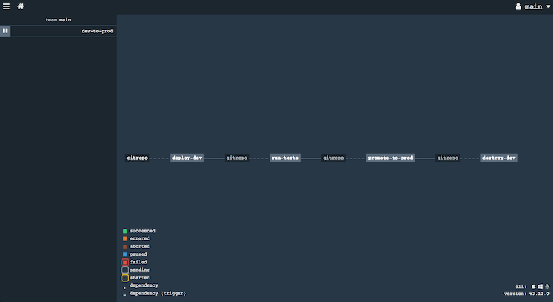

# Description

This is *twitter-analytics* example with a simple application CD pipeline configured in [Concourse CI](http://concourse-ci.org).

The pipeline gives you an idea on how to:
* Make changes to `twitter-stats` code or parameters
* Deploy changes to a Dev environment
* Run tests against the deployed version
* Promote changes to Prod environment
* Destroy Dev environment

# Instructions

1. Make sure Aptomi is running locally and Twitter Analytics example is already imported 

1. Start Concourse CI locally via Docker Compose:
    ```
    cd ~/.aptomi/examples/twitter-analytics-with-concourse-ci
    curl -o docker-compose.yml https://concourse-ci.org/docker-compose.yml
    docker-compose up -d
    ```
1. Check that UI is available at [http://localhost:8080/](http://localhost:8080/). Log into the default team 'main'. It will NOT ask you for password, that's normal.

1. Install `fly` CLI tool for interacting with Concourse CI (you may want to use the latest release if it's later than 3.11.0):
    ```
    curl -L -o fly https://github.com/concourse/concourse/releases/download/v3.11.0/fly_darwin_amd64
    chmod +x fly
    mv fly /usr/local/bin/fly
    ```
   
1. Create a new repo on GitHub where your CI/CD jobs (which run on Concourse CI workers in containers) will be taking the data from 

1. Run the script to initialize your new repo and push the contents of `twitter-analytics-git-repo` into it:
   ```
   ./update-repo.sh [URI_OF_YOUR_CREATED_GIT_REPO]
   ```
 
1. Import Aptomi pipeline into Concourse CI, point it to your repo. It's a good idea to use public repo and "Clone with HTTPS" target, so that CI Job actually has permissions to clone the repo:
    ```
    ./pipelines-upload.sh [URI_OF_YOUR_CREATED_GIT_REPO]
    ```
    
1. Check that the pipeline is displayed in Concourse UI. You should be able to see
   
   
1. The pipeline is configured in such a way that all jobs/tasks need to be triggered manually.
   You can do it with "+" button in UI inside every job.
   
1. Once you run jobs, you will see that individual tasks make calls to Aptomi to deploy/destruct complete application environments

# Useful Links

* https://concoursetutorial.com/
* https://github.com/pivotalservices/concourse-pipeline-samples
* https://github.com/everpeace/concourse-gitlab-flow

