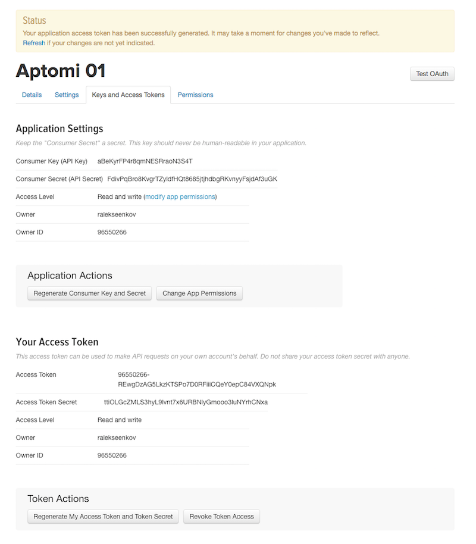

# Description

In this example there are 2 main services:
- `analytics_pipeline` - it consists of kafka, spark, hdfs, zookeeper and is offered in two different contexts
  - *stage*: in sharing all consumers of analytics_pipeline get to share the same instance
  - *production*: a single production instance with more memory, better replicas count, etc 
- `twitter_stats` - it depends on `analytics_pipeline` and consists of 3 components (publisher, stats, ui)
  - it gets data from Twitter in real time, calculates top hashtags using an external service and displays results on a web page


These services have different owners, who can fully control how their services get offered and shared:

User  | Role |
------|-------
Sam   | Domain admin for Aptomi
Frank | Owner of `analytics_pipeline`
John  | Owner of `twitter_stats`
Alice, Bob, Carol | Users and code contributors to `twitter_stats`

This example illustrates a few important things that Aptomi does:

1. **Service-based approach to run applications**
    - Service owners publish their services and fully define how they get offered & shared to others
    - Implementation details are abstracted away from consumers, so they can consume other services without knowing the inner-workings
1. **Service update**
    - Change label with a single command and re-apply only the required delta
1. **Service reuse**
    - Alice and Bob share the same instance of analytics_pipeline in staging
1. **Policy & rules**
    - Different people have different access rights in Aptomi
    - Aptomi can instantiate services with different parameters in different clusters (based on a certain criteria, e.g. even consumer identity)

# Instructions

1. Upload user roles and rules into Aptomi using CLI, then import `analytics_pipeline` and `twitter_stats` services:
    ```
    aptomictl login -u sam -p sam
    aptomictl policy apply -f ~/.aptomi/examples/twitter-analytics/policy/Sam
    aptomictl login -u frank -p frank
    aptomictl policy apply -f ~/.aptomi/examples/twitter-analytics/policy/Frank
    aptomictl login -u john -p john
    aptomictl policy apply -f ~/.aptomi/examples/twitter-analytics/policy/John
    ```

1. At this point all service definition have been published to Aptomi, but nothing has been instantiated yet. You can see
that in Aptomi UI under [Policy Browser](http://localhost:27866/#/policy/browse)

1. Request production instance of `twitter-stats`, as well as two development instances in staging:
    
    Start production instance, wait until it's up: 
    ```
    aptomictl login -u john -p john
    aptomictl policy apply --wait -f ~/.aptomi/examples/twitter-analytics/policy/john-prod-ts.yaml
    ```
    
    Start staging instances, wait until they are up: 
    ```
    aptomictl login -u alice -p alice
    aptomictl policy apply --wait -f ~/.aptomi/examples/twitter-analytics/policy/alice-stage-ts.yaml
    aptomictl login -u bob -p bob
    aptomictl policy apply --wait -f ~/.aptomi/examples/twitter-analytics/policy/bob-stage-ts.yaml
    ```
        
    To check deployment progress for prod and stage, you can run `kubectl get pods` and wait for "1/1" status for all created pods:
    ```
    watch -n1 -d -- kubectl -n east get pods
    watch -n1 -d -- kubectl -n west get pods
    ```
    
    Note that first-time deployment will trigger download of all Helm charts/images (1GB+) and caching them in your k8s cluster(s). This can take a while, depending on your internet connection (pods will be in `ContainerCreating` status)
      * k8s on GKE will give you the best experience (5 min)
      * running locally on Minikube or Docker For Mac will likely be slower (up to 15-20 min) 

    You can observe that:
      * Aptomi is allocating production instance for John in `cluster-us-east` (per [rules.yaml](policy/Sam/rules.yaml))
      * Aptomi is allocating staging instances for Alice & Bob in `cluster-us-west` (per [rules.yaml](policy/Sam/rules.yaml))
      * [Policy Browser](http://localhost:27866/#/policy/browse) -> Desired State: `analytics pipeline` is shared by both Alice and Bob in staging

1. If everything got deployed successfully, you should be able to see service endpoints under [Instances](http://localhost:27866/#/policy/dependencies) in Aptomi UI
    * *tweeviz available over HTTP with fake Twitter data source*
        * running *staging* instance of twitter stats in `cluster-us-west` (Alice's version)
        * running *staging* instance of twitter stats in `cluster-us-west` (Bob's version)
    * *tweeviz NOT available yet over HTTP, but will become available showing real Twitter data once you configure Twitter App Tokens* 
        * running *production* instance of twitter stats in `cluster-us-east` (managed by John)
          
# Advanced: Enabling Streaming Data from Twitter

1. If you want a truly fully functional demo, you can actually inject Twitter App Tokens into John's service instance, so it can pull data over Twitter Streaming API. Create an
application in [Twitter Application Management Console](https://apps.twitter.com)
    
    
    Generate keys and access tokens for it:
    
    
    Once done, update `john-prod-ts.yaml`, enter the created keys/tokens into it, and upload:
    ```
    cp ~/.aptomi/examples/twitter-analytics/policy/john-prod-{ts.yaml,ts-changed.yaml}
    vi ~/.aptomi/examples/twitter-analytics/policy/john-prod-ts-changed.yaml
    aptomictl login -u john -p john
    aptomictl policy apply --wait -f ~/.aptomi/examples/twitter-analytics/policy/john-prod-ts-changed.yaml
    ```
Now if you open tweeviz HTTP endpoint for John's service, you will be able to see tweets coming in real-time over Twitter Streaming API, processed through analytics-pipeline and displayed on the web.

